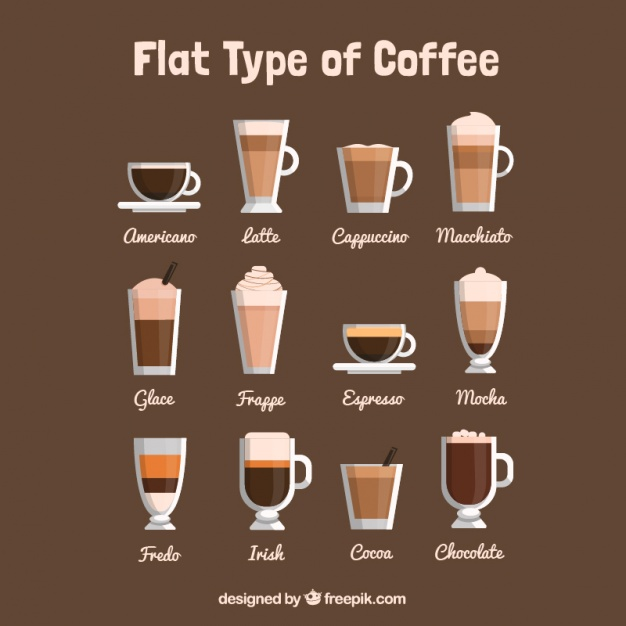

# ycoffee

Repositório do projeto "Seu Café". API com Node.js e TypeScript, frontend com React e React Native.

  

## MVP - Ideia

Produto mínimo viável para cadastro e gerenciamento de receitas de cafés.

## Funcionalidades - RF
  - [x] Cadastrar café
    * tipo
    * descrição
    * ingredientes
    * preparo
    * tempo de preparo
    * porções
    * imagem
    * autor (usuario)

  - [x] Cadastrar usuário
    * nome
    * email
    * senha
    * papel (usuário, administrador, desabilitado)

  - [x] Dashboard admin
    - Habilitar/desabilitar usuário
    - Remover usuários
    - Remover cafés

## Não funcionalidades - RNF

  - [x] Persistir dados em banco não relacional (MongoDB)

## Metodologias

Utilização de DDD (Driven Domain Design) e TDD (Test Driven Development) como metodologias para desenvolvimento da API deste projeto.

## Créditos

Desenvolvido com ♥ por [Thalyson Rodrigues](https://www.linkedin.com/in/thalysonrodrigues/)
